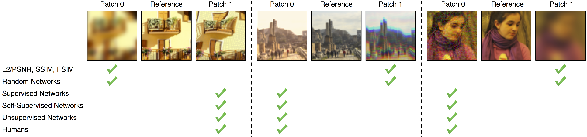

## Jittor version of "Perceptual Similarity Metric" (LPIPS)

**The Unreasonable Effectiveness of Deep Features as a Perceptual Metric**  
Richard Zhang, Phillip Isola, Alexei A. Efros, Eli Shechtman, Oliver Wang. In [CVPR](https://arxiv.org/abs/1801.03924), 2018.



The original page: [[Project Page]](http://richzhang.github.io/PerceptualSimilarity/)

We implement the LPIPS metric of 'alex', 'vgg', 'squeeze' by Jittor.

### Quick start

```
python test_network.py
``` 

The metric results will be printed. 

## Acknowledgements

This repository borrows partially from the original [LPIPS](https://github.com/richzhang/PerceptualSimilarity) repository.
